title: 手軽に使えるChart.jsの基礎知識
author: Tomoyuki Konda 

## Agenda

<link type="text/css" rel="stylesheet" href="./lib/syntaxhighlighter_2.1.382/styles/shCore.css"/>
<link type="text/css" rel="stylesheet" href="./lib/syntaxhighlighter_2.1.382/styles/shThemeEclipse.css"/>

1. ### Chart.jsとは
2. ### Chart.jsの使い方
3. ### デモ
4. ### デモで使用したコード説明
5. ### 注意事項
6. ### まとめ

## Chart.jsとは

* ### 概要
   * #### 簡単に綺麗なグラフが描画できるJavaScriptライブラリ
 
* ### 特徴
   * #### HTML5のCanvas要素を使用
   * #### 色や線に関する設定が豊富
   * #### ６種類のグラフを描画する事ができる
   * #### MITライセンス

## Chart.jsとは - 描画可能なグラフの種類

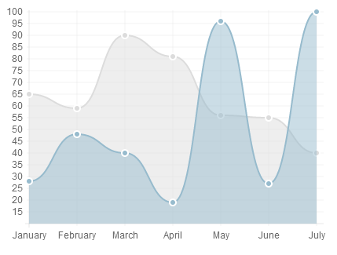
<a style="left:50px; top:340px; position:absolute; color:black; font-weight:bold;">折れ線グラフ</a>

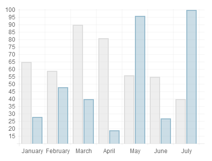
<a style="left:395px; top:340px; position:absolute; color:black; font-weight:bold;">棒グラフ</a>

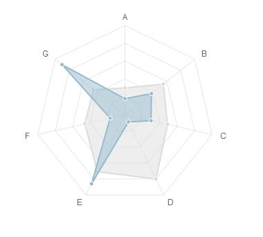
<a style="width:200px; left:670px; top:340px; position:absolute; color:black; font-weight:bold;">レーダーチャート</a>

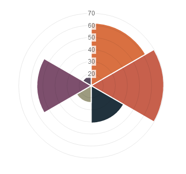
<a style="left:70px; top:620px; position:absolute; color:black; font-weight:bold;">鶏頭図</a>

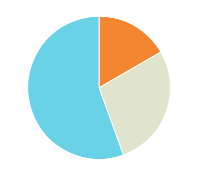
<a style="left:390px; top:620px; position:absolute; color:black; font-weight:bold;">パイチャート</a>

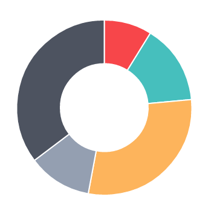
<a style="width:200px; left:670px; top:620px; position:absolute; color:black; font-weight:bold;">ドーナツチャート</a>

## Chart.jsの使い方

1. ### Chart.js取得
2. ### Canvas描画用変数作成
3. ### データ変数作成
4. ### オプション変数作成
5. ### グラフ作成関数呼び出し

## Chart.jsの使い方･･･前準備

* ### Chart.jsを公式HPからダウンロードする

<pre class="brush: html">
  &lt;script type="text/javascript" src="./lib/Chart.js" /&gt; 
</pre>
 

* ### HTML内の描画したい位置にCanvasタグを書く

<pre class="brush: html">
&lt;canvas id="chart_area" /&gt;
</pre>
 

* ### Canvas描画用変数を作成する

<pre class="brush: js">
  var context = $("#chart_area").get(0).getContext("2d");
</pre>

## Chart.jsの使い方･･･データ変数

* ### dataはグラフの種類毎に必要情報が決まっている
   * #### 値と色のデータが必要
* ### 折れ線グラフ、レーダーチャート、棒グラフ
   * #### オブジェクト型
   * #### ラベルが必要
* ### 鶏頭図、パイチャート、ドーナツチャート
   * #### 配列
   * #### ラベルが不要

## 折れ線グラフ・レーダーチャート

<pre class="brush: js">
    // 折れ線グラフ・レーダーチャート
    var data = {
      datasets:[
        {
          // X軸とグラフ間の色
          fillColor:"red",
          // 線の色
          strokeColor: "blue",
          // グラフ上の点の色
          PointColor: "green",
          // 点の縁色
          pointStrokeColor: "black",
          // 表示する値
          data:[20, 40, 30, 10, 50]
        }
      ],
      // X軸上のラベル
      labels:["A", "B", "C", "D", "E"]
    };
</pre>

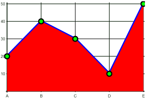
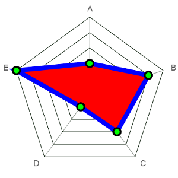

## 棒グラフ

<pre class="brush: js">
    // 棒グラフ
    var data = {
      datasets:[
        {
          // X軸とグラフ間の色
          fillColor:"red",
          // 線の色
          strokeColor: "blue",
          // 表示する値
          data:[20, 40, 30, 10, 50]
        }
      ],
      // X軸上のラベル
      labels:["A", "B", "C", "D", "E"]
    };
</pre>

## パイチャート・ドーナツチャート・鶏頭図

<pre class="brush: js">
    // パイチャート・ドーナツチャート・鶏頭図
    var data = [
      // 表示する値、塗りつぶしの色
      { value: 20, color: "rgba(255, 30, 30, 0.7)"  },
      { value: 40, color: "rgba(255, 255, 30, 0.7)" },
      { value: 30, color: "rgba(30, 255, 30, 0.7)"  },
      { value: 10, color: "rgba(30, 255, 255, 0.7)" },
      { value: 50, color: "rgba(30, 30, 255, 0.7)"  }
    ];
</pre>

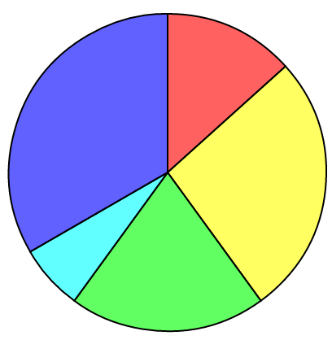
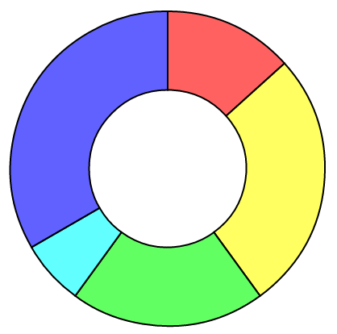
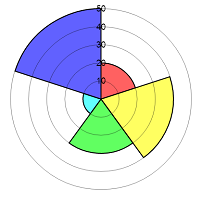

## Chart.jsの使い方･･･オプション変数
* ### オブジェクト型
   * #### 描画に関する設定を行う
 
* ### グラフの種類毎に設定できる項目が決まっている
   * #### 折れ線グラフ - ２７個
   * #### 棒グラフ - ２７個
   * #### ドーナツチャート - １０個
   * #### パイチャート - ９個
   * #### 鶏頭図 - ２７個
   * #### レーダーチャート - ３５個

## X軸・Y軸設定

<link type="text/css" rel="stylesheet" href="./demo.css" />

<pre class="brush: js">
// X軸、Y軸の太さ
scaleLineWidth : 8,
// X軸、Y軸線の色
scaleLineColor : "rgba(255,0,0,1)",
// Y軸の範囲のマニュアル設定有効無効
scaleOverride : true,
//========================================
// scaleOverrideがtrueの場合のみ有効 
//========================================
// Y軸に表示する目盛数
scaleSteps : 5,
// Y軸目盛の幅
scaleStepWidth : 10,
// Y軸の開始数値
scaleStartValue : 0,
//========================================
</pre>

<canvas width="320" height="240"></canvas>

<input type="checkbox" class="demo" name="scaleLineWidth" style="left: -35px; top: 119px;">
<input type="checkbox" class="demo" name="scaleLineColor" style="left: -35px; top: 160px;">
<input type="checkbox" class="demo" name="scaleOverride" style="left: -35px; top: 202px;">

## グリッド線設定

<pre class="brush:js demo">
// グリッド線の幅(太さ)
scaleGridLineWidth : 10,
// グリッド線の色
scaleGridLineColor : "rgba(255, 0, 0, 1)",
// グラフとY軸、X軸、グリッド線が
// 被った時の描画優先順位
scaleOverlay : true,
// グリッド線の描画有効無効
scaleShowGridLines : false,
</pre>

<canvas width="320" height="240"></canvas>

<input type="checkbox" class="demo" name="scaleGridLineWidth" style="left: -35px; top: 120px;">
<input type="checkbox" class="demo" name="scaleGridLineColor" style="left: -35px; top: 160px;">
<input type="checkbox" class="demo" name="scaleOverlay" style="left: -35px; top: 225px;">
<input type="checkbox" class="demo" name="scaleShowGridLines" style="left: -35px; top: 265px;">

## 目盛ラベル設定

<pre class="brush:js demo">
// X軸、Y軸の目盛ラベルの大きさ
scaleFontSize : 32,
// X軸、Y軸の目盛ラベルの文字色
scaleFontColor : "#F00",
// Y軸の目盛ラベル表示内容
scaleLabel : "&lt;%=value%&gt;円"
// X軸、Y軸の目盛ラベルのスタイル
scaleFontStyle : "bold",
// X軸、Y軸の目盛ラベルのフォント
scaleFontFamily : "'Comic Sans MS'",
// Y軸の目盛ラベル表示有効無効 
scaleShowLabels : false,
</pre>

<canvas width="320" height="240"></canvas>

<input type="checkbox" class="demo" name="scaleFontSize" style="left: -35px; top: 119px;">
<input type="checkbox" class="demo" name="scaleFontColor" style="left: -35px; top: 160px;">
<input type="checkbox" class="demo" name="scaleLabel" style="left: -35px; top: 202px;">
<input type="checkbox" class="demo" name="scaleFontStyle" style="left: -35px; top: 245px;">
<input type="checkbox" class="demo" name="scaleFontFamily" style="left: -35px; top: 289px;">
<input type="checkbox" class="demo" name="scaleShowLabels" style="left: -35px; top: 331px;">

## 点設定

<pre class="brush:js demo">
//=======================================
// 点の色情報はデータ作成時に設定します。
//=======================================
// 点表示の有効無効
pointDot : true,
// 点の半径
pointDotRadius : 10,
// 点の円周線の太さ
pointDotStrokeWidth : 10,
</pre>

<canvas width="320" height="240"></canvas>

<input type="checkbox" class="demo" name="pointDot" style="left: -35px; top: 183px;">
<input type="checkbox" class="demo" name="pointDotRadius" style="left: -35px; top: 224px;">
<input type="checkbox" class="demo" name="pointDotStrokeWidth" style="left: -35px; top: 265px;">

## データセット設定

<pre class="brush:js demo">
//============================================
// データ間の線の色と、X軸とデータ間の塗りつぶし色
// 情報はデータ作成時に設定します。
//============================================
// データ（点）間の線表示の有効無効
// 現在オプションは存在するが未実装(2013/08現在)
datasetStroke : true,
// データ（点）間を繋ぐ線の太さ
datasetStrokeWidth : 10,
// X軸とデータ間の塗りつぶし有効無効
datasetFill :true,
// グラフ線曲線化の有効無効
bezierCurve : true,
</pre>

<canvas width="320" height="240"></canvas>

<input type="checkbox" class="demo" name="datasetStrokeWidth" style="left: -35px; top: 265px;">
<input type="checkbox" class="demo" name="datasetFill" style="left: -35px; top: 306px;">
<input type="checkbox" class="demo" name="bezierCurve" style="left: -35px; top: 349px;">

## アニメーション設定

<pre class="brush:js demo">
//========================================
// アニメーション設定
//========================================
// アニメーションの有効無効
animation : true,
// アニメーション時間
animationSteps : 200,
// アニメーション緩和効果種類
animationEasing : "easeInQuart",
// アニメーション終了時コールバック関数
onAnimationComplete : function(){ alert("アニメーション終了！"); };
</pre>

<canvas width="320" height="240"></canvas>

<input type="checkbox" class="demo" name="animation" style="left: -35px; top: 183px;">
<input type="checkbox" class="demo" name="animationSteps" style="left: -35px; top: 224px;">
<input type="checkbox" class="demo" name="animationEasing" style="left: -35px; top: 265px;">
<input type="checkbox" class="demo" name="onAnimationComplete" style="left: -35px; top: 307px;">

## 補足

* ### オプションは全て設定する必要がない

<pre class="brush: js">
var options = {
  // 色（文字列）- X軸、Y軸の色
  scaleLineColor : "rgba(0, 20, 0, 1)",
  // 文字列 - グリッド線の色
  scaleGridLineColor : "rgba(0, 20, 0, 1)",
  // Y軸のラベル変更
  scaleLabel : "&lt;%=value%&gt;万人",
  // グラフ線曲線化の無効
  bezierCurve : false,
  // アニメーションの有効
  animation : true
};
</pre>

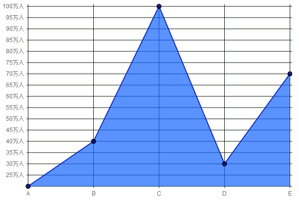

* ### 一つも設定しなくてもグラフは作成できる

<pre class="brush: js">
// 全てデフォルト値で描画
var options = {};
</pre>

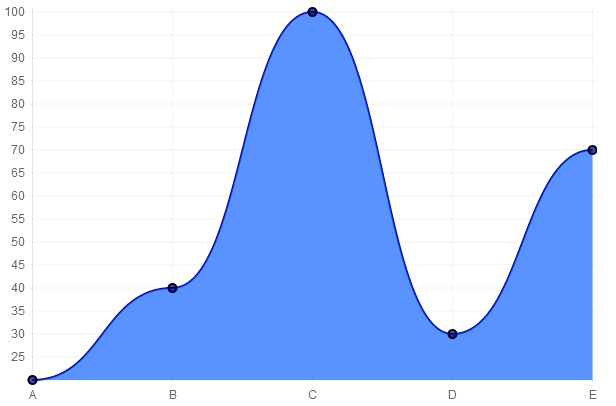

## Chart.jsの使い方･･･グラフ描画

###【例】

<pre class="brush: js">
  new Chart(context).Line(data, options);
</pre>

* #### context  - canvas描画用変数
* #### data  - データ変数
* #### options  - オプション変数
* #### Line  - 生成したいグラフの種類に対応した関数を使用

###【関数名】

1. #### Line() - 折れ線グラフ
2. #### Bar() - 棒グラフ
3. #### Radar() - レーダーチャート
4. #### Pie() - パイチャート
5. #### Doughnut() - ドーナツチャート
6. #### PolarArea() - 鶏頭図

## デモ

### <a href="../demo/">産業別国内総生産グラフ</a>

## デモ説明 

### 1. Ajax通信でcsvファイルを取得

<pre class="brush: js">
getCSVFile = function(){
  $.ajax({
    url:"./data/sales.csv",
    success: loadSuccess,
    error: loadError
  });
};
</pre>
  

### 2. jQuery.csv.jsを使用してcsvデータを配列化

<pre class="brush: js">
csvSales = $.csv.toArrays(obj, 
             {onParseValue: $.csv.hooks.castToScalar});
</pre>

## デモ説明

### 3. データ変数作成

<pre class="brush: js">
// データ変数作成
datas   = makeLineChartData(csvSales);
</pre>
 

### 4. オプション変数作成
<pre class="brush: js">
// オプション変数作成
options = makeLineChartOptions();
</pre>
 

### 5. グラフ関数呼び出し

<pre class="brush: js">
new Chart(canvas).Line(datas, options);
</pre>

## 注意事項 

* ### canvasに対応していないブラウザがある
   * #### canvas非対応ブラウザ対策をする必要がある
 

* ### 各ブラウザのcanvas対応状況
   * #### IE  - 9.0以上
   * #### Chrome  - 2.0以上
   * #### FireFox  - 4.0以上
   * #### iOS Safari  - 3.2以上
   * #### Android Browser  - 2.1以上

## 注意事項 

* ### グラフを表示する機能しかない
   * #### 軸ラベル、データラベル、凡例がない
   * #### 足りない機能は自作するか、別ライブラリを使用する
 
 

* ### 別種類のグラフを複合させる事ができない
   * #### 棒グラフと折れ線グラフなどの組み合わせが出来ない

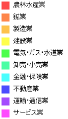
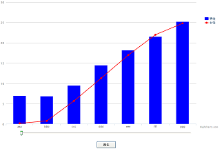

## まとめ

* ### 簡単な手順でグラフが描画できる
   * #### ３つの変数を作成して関数を呼び出すだけ
 

* ### フラットデザインなグラフが作りやすい
   * #### ただしデザイン力が必要
 

* ### 複雑なグラフ作成には不向き

<section class="slide">
<ul>
<ul>
<li><h3>D3.jsがオススメ</li>
</ul>
</ul>
</section>
